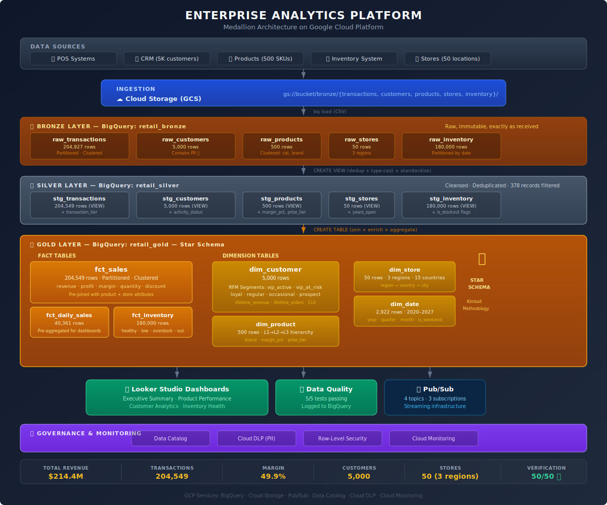

# Lab 01: Enterprise Analytics Platform

> Production-grade data analytics platform using medallion architecture on Google Cloud Platform

[](https://cloud.google.com)
[-orange)](https://www.databricks.com/glossary/medallion-architecture)
[](.)
[](LICENSE)

---

## Business Context

Data platform for a multinational retail corporation operating **50 stores across 15 countries** in three regions (Americas, EMEA, APAC), processing **200K+ transaction line items** across 5 product categories with **5,000 customers** in a loyalty program.

The platform answers questions like:
- What is our revenue by region, channel, and product category?
- Which customers are VIPs at risk of churning?
- Where are we experiencing stockouts vs. overstock?
- What are our daily margin trends across 50 stores?

## Architecture



## Key Technical Decisions

### Why Medallion Architecture?
Raw data preservation enables reprocessing from source when business logic changes. Clear separation between "data as received" (bronze), "data as cleaned" (silver), and "data as needed by the business" (gold). This is the industry standard pattern used at scale by Netflix, Airbnb, and Uber.

### Why BigQuery Views for Silver Layer?
Views cost $0 for storage and always reflect current bronze data. They act as a contract: downstream gold models depend on silver views, not raw tables. If source schemas change, only the silver view SQL needs updating.

### Why Star Schema for Gold Layer?
Dimensional modeling (Kimball methodology) is optimized for analytical queries. Fact tables store measures (revenue, quantity, profit), dimension tables store context (who, what, where, when). BI tools like Looker Studio perform best against star schemas because joins are predictable and aggregations are fast.

### Why Partition + Cluster?
BigQuery charges per bytes scanned. Partitioning by `transaction_date` means a query for "last 30 days" scans ~7% of the data instead of 100%. Clustering by `store_id, product_id` further reduces scan size for filtered queries. Combined, this reduces query cost by 10-100x in production.

### Why Customer Segmentation in the Dimension?
Pre-computing customer segments (VIP Active, VIP At Risk, Loyal, Regular, Occasional, Prospect) in `dim_customer` means every dashboard and report gets consistent segmentation without recomputing. The segmentation uses RFM-inspired logic: Recency (days since last purchase), Frequency (lifetime orders), and Monetary (lifetime revenue).

## GCP Services Used

| Service | Purpose | Why This Service |
|---------|---------|-----------------|
| **BigQuery** | Data warehouse (all 3 layers) | Serverless, scales to petabytes, SQL-native, $0 for first 1TB queries/month |
| **Cloud Storage** | Raw data lake (bronze backup) | Immutable object storage with lifecycle policies, $0.02/GB/month |
| **Pub/Sub** | Event streaming infrastructure | Serverless messaging for real-time ingestion pattern, guaranteed delivery |
| **Data Catalog** | Metadata management | Column-level security tags, data classification taxonomy |
| **Cloud DLP** | PII detection | Automated scanning for emails, phone numbers, addresses in customer data |
| **Cloud Monitoring** | Pipeline health | Alerting on BigQuery slot usage, Pub/Sub backlogs, job failures |

## Data Model

### Fact Tables

**fct_sales** — Central sales fact (grain: one row per transaction line item)
- Partitioned by `transaction_date` (DAY), clustered by `store_id`, `product_id`
- Measures: quantity, unit_price, discount_amount, tax_amount, total_amount, gross_profit, margin_pct
- Pre-joined with product and store attributes to minimize dashboard joins

**fct_daily_sales** — Pre-aggregated daily metrics (grain: one row per store × channel × date)
- Designed for dashboard performance — avoids scanning 200K+ row fact table for trend charts
- Measures: transaction_count, units_sold, unique_customers, gross_revenue, gross_profit, margin_pct

**fct_inventory** — Daily inventory snapshots (grain: one row per store × product × date)
- Classifies each record as: healthy, low_stock, overstock, or stockout
- Enables supply chain analytics and reorder alerting

### Dimension Tables

**dim_customer** — Enriched with lifetime metrics computed from transaction history
- Lifetime orders, revenue, avg order value, days since last purchase
- RFM-based segmentation: vip_active, vip_at_risk, loyal, regular, occasional, prospect
- Activity status: active (≤30d), at_risk (≤90d), lapsed (≤365d), dormant (>365d)

**dim_product** — Full category hierarchy (L1 → L2 → L3) with margin analysis
- Price tiers: value (<$100), mid_range ($100-500), premium (>$500)
- Pre-computed margin_pct for profitability analysis

**dim_store** — Geographic hierarchy with operational metadata
- Region (AMERICAS/EMEA/APAC) → Country → City
- Store type: flagship, standard, outlet, warehouse

**dim_date** — 8-year calendar (2020-2027) with fiscal and business attributes

## Data Quality

5 automated tests run after every pipeline execution:

| Test | Model | What It Validates |
|------|-------|-------------------|
| not_null_total_amount | fct_sales | No revenue values are NULL |
| unique_customer_id | dim_customer | No duplicate customers |
| unique_product_id | dim_product | No duplicate products |
| accepted_values_region | fct_sales | Only AMERICAS, EMEA, APAC |
| accepted_values_channel | fct_sales | Only online, in_store, mobile_app |

All results are logged to `retail_data_quality.test_results` for historical tracking.

## Sample Query Results

### Revenue by Region
```
+--------------+--------+-------------+-------------+------------+
| store_region | orders |   revenue   |   profit    | margin_pct |
+--------------+--------+-------------+-------------+------------+
| AMERICAS     |  40062 | 86,372,498  | 43,113,800  |       49.9 |
| EMEA         |  35865 | 77,542,580  | 38,769,811  |       50.0 |
| APAC         |  24073 | 50,459,945  | 25,164,119  |       49.9 |
+--------------+--------+-------------+-------------+------------+
```

### Inventory Health (Latest Snapshot)
```
+------------------+----------------------+------+
| inventory_status | product_store_combos | pct  |
+------------------+----------------------+------+
| healthy          |                 4254 | 70.9 |
| overstock        |                  748 | 12.5 |
| low_stock        |                  699 | 11.7 |
| stockout         |                  299 |  5.0 |
+------------------+----------------------+------+
```

## Project Structure

```
lab-01-enterprise-analytics/
├── README.md                          # This file
├── verify.sh                          # Verification script — validates all components
├── docs/
│   ├── ARCHITECTURE.md                # Detailed architecture decisions
│   └── COST_ANALYSIS.md               # Production cost estimates
├── scripts/
│   ├── 01_enable_apis.sh              # Enable required GCP APIs
│   ├── 02_create_storage.sh           # GCS bucket and folder structure
│   ├── 03_create_datasets.sh          # BigQuery datasets
│   ├── 04_create_bronze_tables.sh     # Bronze layer table definitions
│   ├── 05_create_pubsub.sh            # Pub/Sub topics and subscriptions
│   ├── 06_generate_data.py            # Sample data generator (Python)
│   ├── 07_upload_to_gcs.sh            # Upload CSVs to GCS
│   ├── 08_load_bronze.sh              # Load CSVs into BigQuery
│   ├── 09_create_silver_views.sh      # Silver layer view definitions
│   ├── 10_create_gold_tables.sh       # Gold layer star schema
│   ├── 11_run_quality_tests.sh        # Data quality test suite
│   └── 12_business_queries.sh         # Validation queries
├── sql/
│   ├── silver/
│   │   ├── stg_transactions.sql       # Transaction cleansing logic
│   │   ├── stg_customers.sql          # Customer standardization
│   │   ├── stg_products.sql           # Product enrichment
│   │   ├── stg_stores.sql             # Store standardization
│   │   └── stg_inventory.sql          # Inventory flag derivation
│   └── gold/
│       ├── fct_sales.sql              # Sales fact with profit calc
│       ├── fct_daily_sales.sql        # Pre-aggregated daily metrics
│       ├── fct_inventory.sql          # Inventory with status classification
│       ├── dim_customer.sql           # Customer with RFM segmentation
│       ├── dim_product.sql            # Product with category hierarchy
│       ├── dim_store.sql              # Store with geographic hierarchy
│       └── dim_date.sql               # Date dimension generator
└── dashboards/
    └── screenshots/                   # Looker Studio dashboard captures
```

## How to Run

### Prerequisites
- GCP project with billing enabled (sandbox or personal)
- `gcloud` CLI authenticated
- Python 3.9+

### Quick Start
```bash
# Set your project
export PROJECT_ID="your-project-id"
export BUCKET_NAME="your-bucket-name"
export REGION="us-central1"
gcloud config set project ${PROJECT_ID}

# Run each script in order
bash scripts/01_enable_apis.sh
bash scripts/02_create_storage.sh
bash scripts/03_create_datasets.sh
bash scripts/04_create_bronze_tables.sh
bash scripts/05_create_pubsub.sh
python3 scripts/06_generate_data.py
bash scripts/07_upload_to_gcs.sh
bash scripts/08_load_bronze.sh
bash scripts/09_create_silver_views.sh
bash scripts/10_create_gold_tables.sh
bash scripts/11_run_quality_tests.sh

# Verify everything
bash verify.sh
```

### Cost
- **GCP Sandbox:** $0
- **Personal GCP (free tier):** ~$10-15/month
- **Production estimate:** ~$19,000/month at 25M transactions (see docs/COST_ANALYSIS.md)

## What I'd Add in Production

- **dbt** for transformation management (version control, testing, documentation)
- **Cloud Composer (Airflow)** for scheduled orchestration
- **SCD Type 2** on customer dimension via dbt snapshots
- **Datastream** for real-time CDC from source databases
- **Column-level security** via Data Catalog policy tags on PII fields
- **Looker** (enterprise) with LookML semantic layer replacing Looker Studio
- **CI/CD** pipeline: PR → dbt test → deploy to BigQuery

## Author

Built as part of an advanced GCP ML/AI portfolio targeting Google Cloud Solutions Architect roles.

## License

MIT

