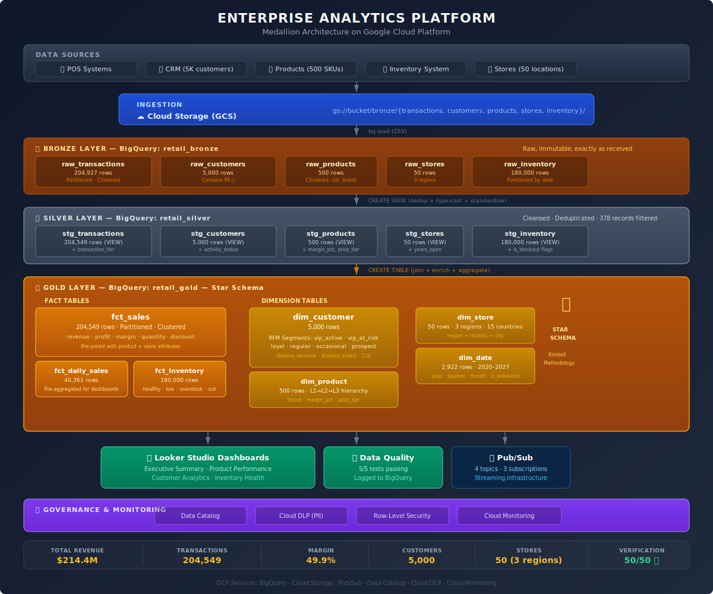

# Enterprise Analytics Platform

Production-grade data analytics platform using medallion architecture on Google Cloud Platform. Built for a multinational retail scenario: 50 stores across 15 countries, 200K+ transaction line items, 5,000 loyalty program customers across Americas, EMEA, and APAC.

---

## Architecture



---

## Key Technical Decisions

**Why Medallion Architecture?** Raw data preservation enables reprocessing from source when business logic changes. Clear separation between "data as received" (bronze), "data as cleaned" (silver), and "data as needed by the business" (gold). Industry standard pattern used at scale by Netflix, Airbnb, and Uber.

**Why BigQuery Views for Silver Layer?** Views cost $0 for storage and always reflect current bronze data. They act as a contract: downstream gold models depend on silver views, not raw tables. If source schemas change, only the silver view SQL needs updating.

**Why Star Schema for Gold Layer?** Dimensional modeling (Kimball methodology) is optimized for analytical queries. Fact tables store measures (revenue, quantity, profit), dimension tables store context (who, what, where, when). BI tools like Looker Studio perform best against star schemas because joins are predictable and aggregations are fast.

**Why Partition + Cluster?** BigQuery charges per bytes scanned. Partitioning by `transaction_date` means a query for "last 30 days" scans ~7% of the data instead of 100%. Clustering by `store_id, product_id` further reduces scan size for filtered queries. Combined, this reduces query cost by 10-100x in production.

**Why Customer Segmentation in the Dimension?** Pre-computing customer segments (VIP Active, VIP At Risk, Loyal, Regular, Occasional, Prospect) in `dim_customer` means every dashboard and report gets consistent segmentation without recomputing. The segmentation uses RFM-inspired logic: Recency (days since last purchase), Frequency (lifetime orders), and Monetary (lifetime revenue).

---

## GCP Services Used

| Service | Purpose | Why This Service |
|---------|---------|-----------------|
| BigQuery | Data warehouse (all 3 layers) | Serverless, scales to petabytes, SQL-native, $0 for first 1TB queries/month |
| Cloud Storage | Raw data lake (bronze backup) | Immutable object storage with lifecycle policies, $0.02/GB/month |
| Pub/Sub | Event streaming infrastructure | Serverless messaging for real-time ingestion pattern, guaranteed delivery |
| Data Catalog | Metadata management | Column-level security tags, data classification taxonomy |
| Cloud DLP | PII detection | Automated scanning for emails, phone numbers, addresses in customer data |
| Cloud Monitoring | Pipeline health | Alerting on BigQuery slot usage, Pub/Sub backlogs, job failures |

---

## Data Model

### Fact Tables

**fct_sales** - Central sales fact (grain: one row per transaction line item). Partitioned by `transaction_date` (DAY), clustered by `store_id`, `product_id`. Measures: quantity, unit_price, discount_amount, tax_amount, total_amount, gross_profit, margin_pct. Pre-joined with product and store attributes to minimize dashboard joins.

**fct_daily_sales** - Pre-aggregated daily metrics (grain: one row per store x channel x date). Designed for dashboard performance - avoids scanning 200K+ row fact table for trend charts. Measures: transaction_count, units_sold, unique_customers, gross_revenue, gross_profit, margin_pct.

**fct_inventory** - Daily inventory snapshots (grain: one row per store x product x date). Classifies each record as healthy, low_stock, overstock, or stockout. Enables supply chain analytics and reorder alerting.

### Dimension Tables

**dim_customer** - Enriched with lifetime metrics computed from transaction history. RFM-based segmentation: vip_active, vip_at_risk, loyal, regular, occasional, prospect. Activity status: active (<=30d), at_risk (<=90d), lapsed (<=365d), dormant (>365d).

**dim_product** - Full category hierarchy (L1 -> L2 -> L3) with margin analysis. Price tiers: value (<$100), mid_range ($100-500), premium (>$500). Pre-computed margin_pct for profitability analysis.

**dim_store** - Geographic hierarchy: Region (AMERICAS/EMEA/APAC) -> Country -> City. Store types: flagship, standard, outlet, warehouse.

**dim_date** - 8-year calendar (2020-2027) with fiscal and business attributes.

---

## Data Quality

5 automated tests run after every pipeline execution:

| Test | Model | What It Validates |
|------|-------|-------------------|
| not_null_total_amount | fct_sales | No revenue values are NULL |
| unique_customer_id | dim_customer | No duplicate customers |
| unique_product_id | dim_product | No duplicate products |
| accepted_values_region | fct_sales | Only AMERICAS, EMEA, APAC |
| accepted_values_channel | fct_sales | Only online, in_store, mobile_app |

All results are logged to `retail_data_quality.test_results` for historical tracking.

---

## Sample Query Results

### Revenue by Region

```
+--------------+--------+-------------+-------------+------------+
| store_region | orders |   revenue   |   profit    | margin_pct |
+--------------+--------+-------------+-------------+------------+
| AMERICAS     |  40062 | 86,372,498  | 43,113,800  |       49.9 |
| EMEA         |  35865 | 77,542,580  | 38,769,811  |       50.0 |
| APAC         |  24073 | 50,459,945  | 25,164,119  |       49.9 |
+--------------+--------+-------------+-------------+------------+
```

### Inventory Health (Latest Snapshot)

```
+------------------+----------------------+------+
| inventory_status | product_store_combos | pct  |
+------------------+----------------------+------+
| healthy          |                 4254 | 70.9 |
| overstock        |                  748 | 12.5 |
| low_stock        |                  699 | 11.7 |
| stockout         |                  299 |  5.0 |
+------------------+----------------------+------+
```

---

## Repository Structure

```
enterprise-analytics/
    README.md
    architecture_diagram.svg
    docs/
        ARCHITECTURE.md         # Architecture decision records
        COST_ANALYSIS.md        # Production cost estimates
    sql/
        silver/
            stg_transactions.sql
            stg_customers.sql
            stg_products.sql
            stg_stores.sql
            stg_inventory.sql
        gold/
            fct_sales.sql
            fct_daily_sales.sql
            fct_inventory.sql
            dim_customer.sql
            dim_product.sql
            dim_store.sql
            dim_date.sql
```

---

## How to Run

### Prerequisites

- GCP project with billing enabled (sandbox or personal)
- `gcloud` CLI authenticated
- Python 3.9+

### Quick Start

```bash
export PROJECT_ID="your-project-id"
export BUCKET_NAME="your-bucket-name"
export REGION="us-central1"
gcloud config set project ${PROJECT_ID}

bash scripts/01_enable_apis.sh
bash scripts/02_create_storage.sh
bash scripts/03_create_datasets.sh
bash scripts/04_create_bronze_tables.sh
bash scripts/05_create_pubsub.sh
python3 scripts/06_generate_data.py
bash scripts/07_upload_to_gcs.sh
bash scripts/08_load_bronze.sh
bash scripts/09_create_silver_views.sh
bash scripts/10_create_gold_tables.sh
bash scripts/11_run_quality_tests.sh
```

### Cost

- GCP Sandbox: $0
- Personal GCP (free tier): ~$10-15/month
- Production estimate: ~$19,000/month at 25M transactions (see [docs/COST_ANALYSIS.md](docs/COST_ANALYSIS.md))

---

## What I'd Add in Production

- **dbt** for transformation management (version control, testing, documentation)
- **Cloud Composer (Airflow)** for scheduled orchestration
- **SCD Type 2** on customer dimension via dbt snapshots
- **Datastream** for real-time CDC from source databases
- **Column-level security** via Data Catalog policy tags on PII fields
- **Looker** (enterprise) with LookML semantic layer replacing Looker Studio
- **CI/CD** pipeline: PR -> dbt test -> deploy to BigQuery

---

## Disclaimer

Built as a portfolio lab exercise for educational and demonstration purposes. Not intended for production use without further hardening, security review, and compliance validation. Sample data is synthetically generated and does not represent any real company or individuals.

---

## Author

**Gregory B. Horne**
Cloud Solutions Architect

[GitHub: gbhorne](https://github.com/gbhorne) | [LinkedIn](https://linkedin.com/in/gbhorne)

---

## License

MIT
